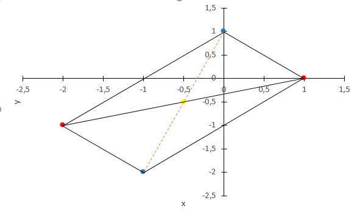
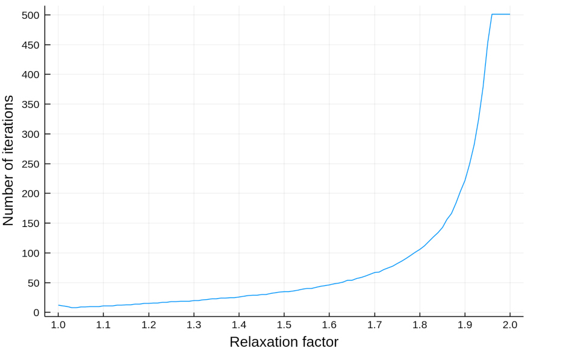

# SOR iteration for sparse matrices

Sparse matrix respresent a matrix which consists mainly of zero elements. Computer processing of large sparse matrices becomes inefficient in terms of memory and time since resources are spent in vain to store huge amounts of zeros.

Let's define sparse matrix $`A`$:  

```math
A=\left(\begin{array}{rrr} 7 & 0 & 2 & 0 \\ 0 & 0 & 0 & 0\\ 3 & 1 & 0 & 0 \\ 0 & 0 & 1 & 0 \end{array}\right).
```
One of the solutions for efficiently representing and storing sparse matrices lays down in storing non-zero elemnents into two, smaller matrices. Matrix $`V`$ stores element values, while matrix $`I`$ stores indexes where those elements appear in the matrix $`A`$.

```math
 V(i,j) = M(i, I(i,j))
```
Therefore, we have:

```math
V = [[7, 2], [], [3,1],[1]]\\
I_A = [[1, 3], [], [1,2],[3]]
```
---
## Multiplication

The above defined approach for sparse-matrix representation does not benefit only in terms of saving memory consumption but it highly optimizes the matrix vector multiplication. 

Let's say we have matrix A of size 1000 x 1000, with only 100 non-zero elements and multiply it with a vector of size 1000. Matrix-vector multiplication requires each element in a matrix row to be multiplied with an element in the vector, total of 1000000 operations. If such a matrix is represented in the compact, afore mentioned way, the total number of operations lowers down to 100000.

---

## Successive over-relaxation

SOR is a numerical method which builds upon the Gauss-Seidl iterative method and allows us to solve $`Ax = b`$ iteratively, resulting in faster convergence than Gauss-Seidel method.

---
## Example: Embedding graph into the plane
In order to demonstrate capabilities and the convergence speed of SOR method, the following simple example is solved.




Let's start with undirected graph G. The nodes colored in red are those whose exact position is unknown.
Let's assume that the connections in the graph represent springs, which have mass. Since the force of the spring between i-th and j-th point is equal to :

```math
	F_ij = [x_j-x_i,y_j-y_i] \\
```

In equilibrium, the sum of all forces is equal to 0, so we have following equations, for each component of the force F.

```math
	-st(i)x_i + \sum_{j \in N(i)}^{} x_j = 0 \\
	-st(i)y_i + \sum_{j \in N(i)}^{} y_j = 0
```

For each component of the force we get as many equations as the number of unknown nodes are. Plugging in the coordinates of the known nodes in the above mentioned equations we get following system of equations to solve : 
```math
	\left[ \begin{array}{rr}-3 & 1 \\ 1 & -3\end{array}\right] \left[ \begin{array}{r}x_1 \\ x_2\end{array}\right] = \left[ \begin{array}{r}1 \\ 1\end{array}\right]
```



The above graph represents relation between number of iterations required for convergence and the relaxation factor omega. We can see that the fastest convergence of 8 iterations was when relaxation factor was 1.02 . The convergence of the algorithm is highly dependent on the right choice of the relaxation factor.


