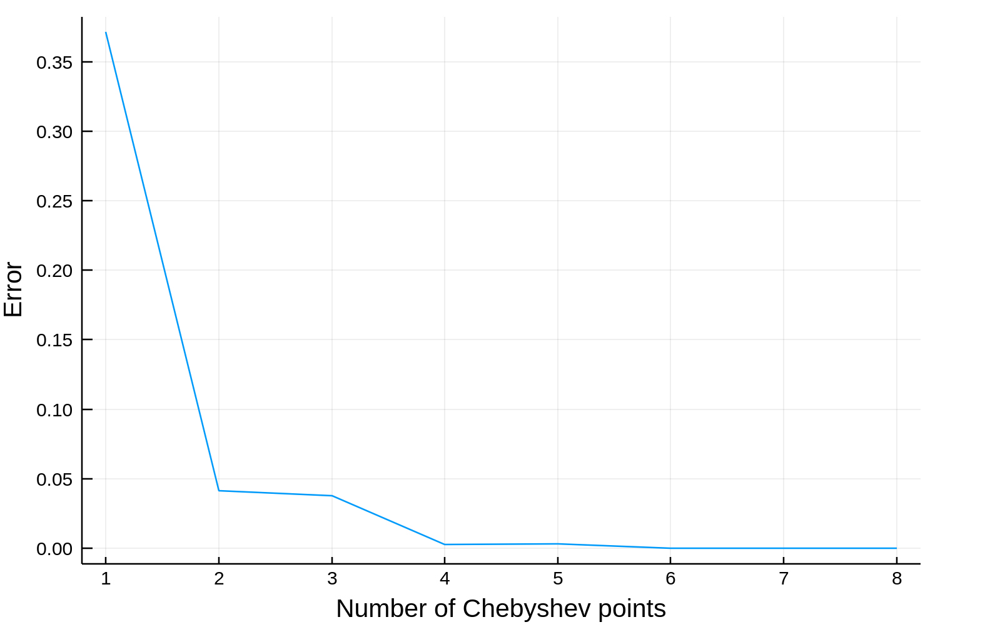

## Lagrange interpolation with Barycentric formula

Interpolation represents a kind of estimation in which we start with a range of discrete set of known x-coordinates and its corresponding y - coordinates with the goal of estimating y - values for the newly added points. Basic approach in finding right interpolation function is Polynomial interpolation.

Polynomial interpolation is based onto constructing a polynomial for each data point from the known discrete set of points, constructing a system of n+1 equations.

```math
P_n(x_i) = y_i
```
 Approach based on constructing a polynomial is numerically unstable with respect to pertubations, thus not very useful in practice.

 In practice, often used approach is based on Lagrange polynomials which calculates in advance a set of polynomials for each known point from a discrete dataset thus allowing more flexibility and reducing the time complexity to O(n) for evaluating the polynomial. Such an approach uses Barycentric formula. 

 ```math
l(x)=\begin{cases}
\frac{\sum\frac{f(x_{j})\lambda_{j}}{x-x_{j}}}{\sum\frac{\lambda_{j}}{x-x_{j}}} & x\not=x_{j}\\
f(x_{j}) & \text{sicer}
\end{cases}
```
In order to avoid Runge phenomenon and to reach well-conditioned interpolation the data points have to be equally spreaded. Such a special set of points is called Chebyshev points.

```math
x_{j}=\cos\left(\frac{j\pi}{n}\right);\quad j=0\ldots n,

```

For Chebyshev set of points Barycentric weights have explicit formula

```math
l(x)=\begin{cases}
\frac{\sum\frac{f(x_{j})\lambda_{j}}{x-x_{j}}}{\sum\frac{\lambda_{j}}{x-x_{j}}} & x\not=x_{j}\\
f(x_{j}) & \text{sicer}
\end{cases}
```


### Results

The Lagrange interpolation with Barycentric formula was tested on a set of three continous functions with the error being less than threshold $`10^{-6}`$: <br />
$`e^{-x^{2}}`$ on interval $`[-1,1]`$  with a polynomial degree 9  <br />
$`\frac{\sin x}{x}`$ on interval $`[0,10]`$ with a polynomial degree 10 <br />
$`|x^{2}-2x|`$ on interval $`[1,3]`$ with a polynomial degree 224 <br />

The correaltion of error with the number of Chebyshev points for interpolation function $`e^{-x^{2}}`$ on interval $`[-1,1]`$ 




