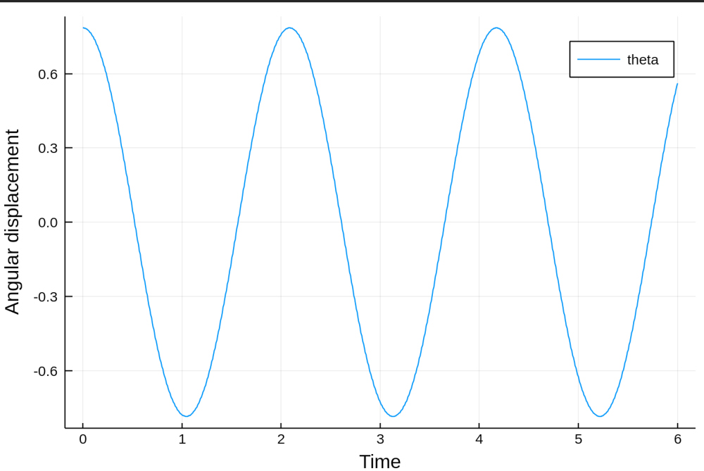
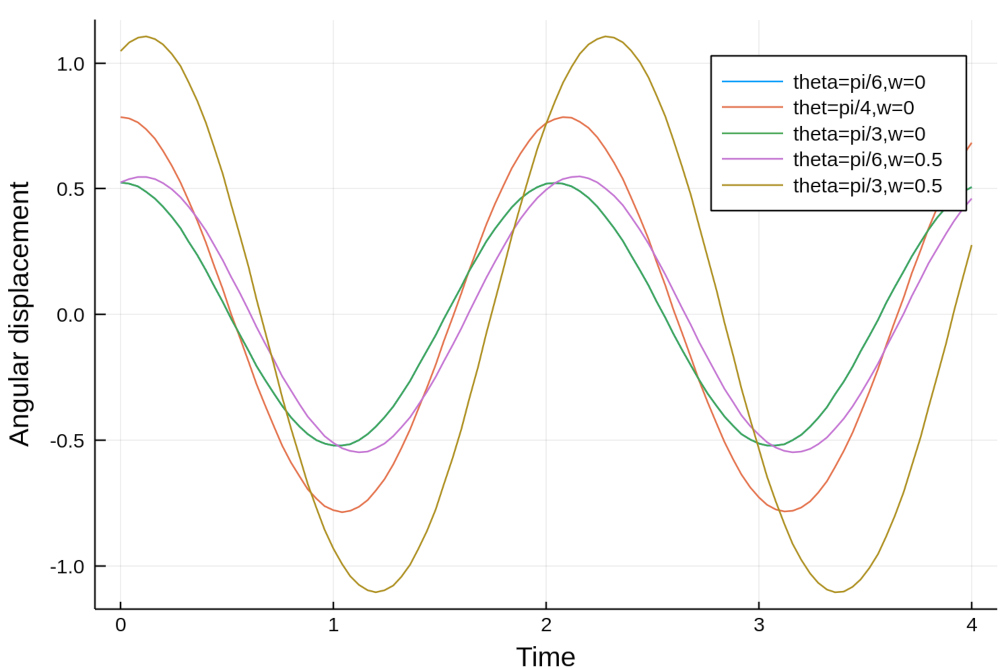
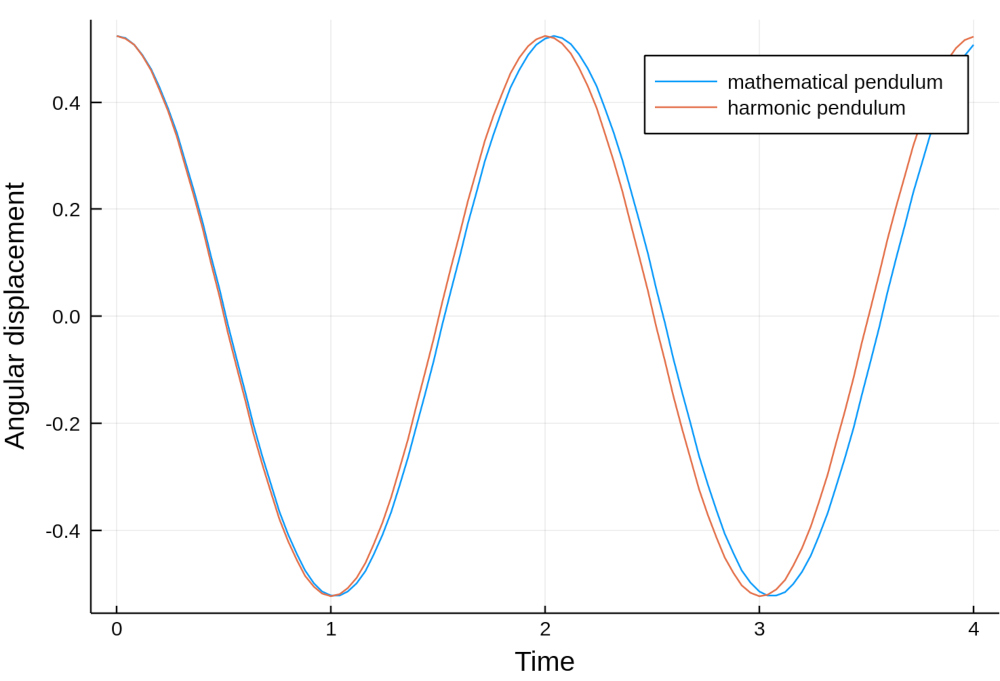
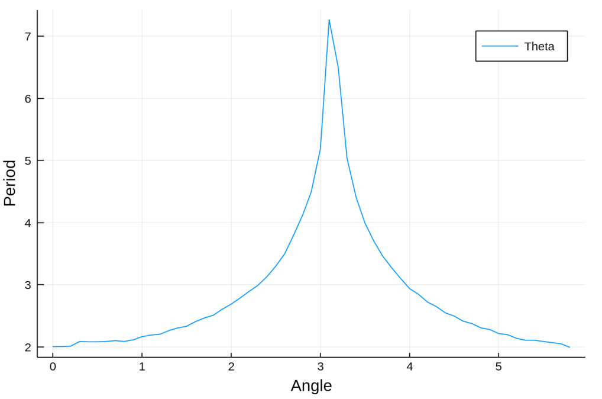
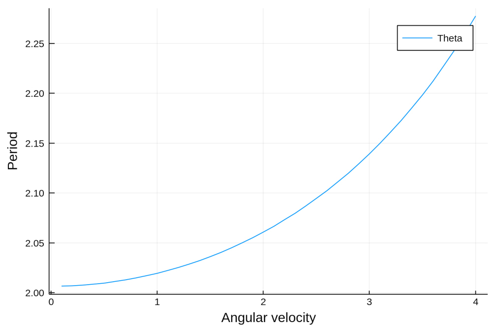

## Mathematical pendulum

Mathematical pendulum is a simplification in ideal conditions of real pendulum. Simple gravity pendulum comes from a fact that there is no friction considered in a model. Such a model does not lose any frictional energy, thus the pendulum will swing back and forth at a constant amplitude. With afore stated initial conditions the model can be described with a second order differential equation.

```math
\frac{g}{l}sin(\theta(t)) + \theta''(t) = 0; \theta(0) = \theta_0, \theta'(0) = \theta_0'
```
Our goal is to calculate the angular displacement $`\theta(t)`$. In order to accomplish the goal the above differential equation can be rewritten as a system of first order differential equations and further be solved with a Runge-Kutta 4th order method.

```math
\theta' = \dtheta \\
\dtheta' = -\frac{g}{l}sin(\theta(t))
```

Runge-Kutta method of fourth degree is used in order to solve the ODE.

```math
k_1 = h*f(t_n, y_n) \\
k_2 = h*f(t_n+h/2, y_n+k_1/2) \\
k_3 = h*f(t_n+h/2,y_n+k_2/2) \\
k_4 = h*f(t_n+h, y_n+k_3) \\ \\
```

```math
y_{n+1} = y_n + (k_1+2k_2+2k_3+k_4)/6
```

### Properties of mathematical pendulum
The graph shows afore stated property of mathematical pendulum having fixed amplitude due to non-losing frictional energy while oscilating. Under the restriction that friction is neglected, energy of the pendulum can be expressed as:
```math
E = \frac{1}{2} * m * l^2 * \theta^2 + m*g*l*(1- cos(\theta)) 
```
Simulation of the pendulum is conducted on the interval [0,6] with initial angular displacement of $`\theta0 = \pi/4`$ and angular velocity $`\dtheta0 =  0`$. 


The period of one oscilation of a pendulum is dependant on the initial angular displacement $`\theta0`$ and initial angular velocity $`\dtheta0`$ (energy). 
Graph below represents simulation of the pendulum at different combinations of initial conditions. When the initial angle and angular velocity is set very high mathematical pendulum starts to swing around it's axis.



For the small amplitude, mathematical pendulum can be approximated with simple harmonic oscilator given by formula:
```math
    \theta (t) = \theta_0cos(\sqrt{\frac{g}{l}}+)
```
From the graph we can see that for the smaller initial angular displacement ($`\theta0 = pi/6`$)  harmonic oscilator serves as a good approximation.


The period of harmonic oscilator T_0 is independent of the amplitude:
```math
    \theta (t) = \theta_0cos(\sqrt{\frac{g}{l}})
```

In order to calculate the period of mathematical pendulum which is dependent of the initial conditions (energy),
an approach is to calculate the initial approximation by first calculating the period with finding the next point in time where the simulation reaches the initial angle and then use the Newton method to get a better approximation of the function's zeros.

The graphs below shows the dependance of the period of mathematical pendulum with respect to initial,starting conditions.




